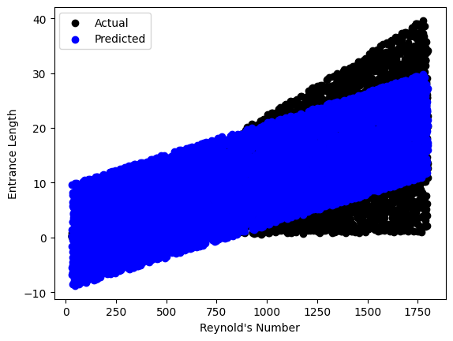
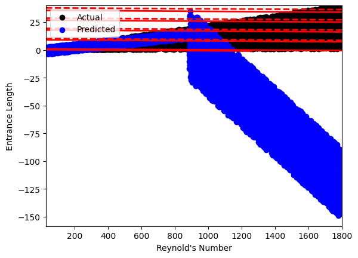

# Prediction of Hydrodynamic Entrance Length at Low Reynolds Numbers using Machine Learning

A machine learning pipeline (built in Python) for predicting the hydrodynamic entrance length of a pipe for low-Reynolds-number (laminar) flow, evaluating both global regression and localized clustering models.

---

## 1. What this project does

In internal aerodynamics and aerospace fluid systems, the hydrodynamic entrance length is the distance required for a flow to transition from a developing, non-uniform velocity profile to a fully developed parabolic profile. This project builds a data-driven ML pipeline — including data preprocessing, regression modeling, and unsupervised clustering — and uses it to study:

1. How the entrance length distributes across varying pipe diameters and Reynolds numbers in the laminar regime.
2. The predictive capability of standard Linear Regression versus margin-based Support Vector Regression (SVR) in mapping a complex rational/polynomial fluid relation.
3. Whether segmenting the data into distinct flow regimes (a K-Means clustering study) improves the predictive accuracy of the SVR models.

Everything — the dataset loading, the train-test splitting, the linear and SVR model formulation, the K-Means clustering application, and the interactive prediction prompt — is systematically structured to analyze mathematical relationships using Python's core data science libraries.

---

## 2. Physical problem setup

| Aspect | Description |
|---|---|
| Geometry | Straight circular pipe cross-section |
| Flow Regime | Laminar flow (Low Reynolds Number) |
| Analysis type | Steady-state fluid mechanics, followed by machine learning regression and clustering |
| Target Variable | Hydrodynamic Entrance Length ($L$) |

### Governing physics
- **Fluid Dynamics:** The problem relies on the established empirical relationship for predicting the theoretical entrance length ($L_e$) in laminar pipe flow. The non-linear formulation used to generate the dataset is expressed as:
$$L_e/D = \frac{0.6}{1 + 0.035Re} + 0.056Re$$

### Inputs / Boundary data

| Parameter | Symbol | Range / Value |
|---|---|---|
| Reynolds Number | $Re$ | Swept continuously from 40 to 2000 |
| Pipe Diameter | $D$ | Swept continuously from 0.01 m to 0.4 m |
| Total Data Samples | — | 34,960 rows |

---

## 3. Modeling assumptions (explicitly stated for transparency)

- **Laminar Flow Only:** The Reynolds number is strictly capped at $Re = 2000$. Turbulent transition ($Re > 4000$) where the entrance length scales differently is explicitly excluded.
- **Idealized Synthetic Data:** The dataset is synthetically generated from the exact empirical relation, assuming perfect physical compliance without experimental noise, measurement error, or viscous dissipation.
- **SVR Kernel Limitation:** The Support Vector Machine models are deliberately restricted to a `linear` kernel. This is a methodological choice to test the limits of linear hyperplanes on a rational function, which is called out explicitly in the results/limitations section below.

These are stated up front deliberately — every ML model is an approximation of the data it is fed, and being explicit about the fluid dynamics constraints ensures the predictions are not misused outside their aerodynamic scope.

---

## 4. Methodology

1. **Data Preprocessing** — The synthetic dataset (`Training_data.csv`) is loaded via Pandas, separating features ($Re$, $D$) from the target ($L$). The data is split into a 70% training set and a 30% testing set (using `random_state=42`) to ensure robust out-of-sample validation.
2. **Linear Regression Solve (Baseline)** — Assembles a standard multiple linear regression model to capture the overarching linear dependence (driven heavily by the $0.056Re$ term in the physical equation). 
3. **Support Vector Regression (SVR) Solve** — Assembles an SVR model using a linear kernel to map the high-dimensional relationships. 
4. **K-Means Clustering + SVR** — The training data is segmented into 2 clusters using K-Means (`n_clusters=2`, `k-means++` initialization) based on $Re$ and $D$. A separate linear SVR model is then fitted specifically to the subset of data within each cluster to test if localized flow regimes improve performance.
5. **Interactive Prediction Module** — An interactive prompt evaluates user-provided inputs (`REYREY`, `DIAMETER`) against the trained model to instantly output the predicted entrance length.

---

## 5. Verification (Evaluation against analytical solutions)

The machine learning formulations are checked against the known analytical outputs in the testing set using standard regression metrics.

| Check | Expected Behavior | Metric Used |
|---|---|---|
| Model error minimization | Minimal deviation from theoretical $L_e$ | Mean Squared Error (MSE) |
| Variance explanation | Capture the physical relationship trend | R-squared ($R^2$) Score |

---

## 6. Results

### 6.1 Global Regression Performance



| Model | MSE | $R^2$ Score | Observation |
|---|---|---|---|
| **Linear Regression** | 10.93 | 0.858 (~86%) | Captured the primary linear dependence effectively; best global predictor. |
| **Standard SVR** | 1289.29 | -15.68 | Linear margin failed entirely to map the non-linear rational term. |

### 6.2 K-Means Clustering Flow Regimes



| Model | MSE | $R^2$ Score | Observation |
|---|---|---|---|
| **K-Means + SVR** | 3676.74 | -46.59 | Segmenting data into localized clusters did not resolve the linear kernel's inability to model the fluid dynamics. |

- The K-Means algorithm successfully segmented the feature space into two distinct regimes (visible via contour mapping). 
- However, combining clustering with a linear-kernel SVR yielded an $R^2$ of -46.59, proving that spatial clustering cannot compensate for an inadequate model hypothesis space (i.e., using a linear solver for non-linear physics).

---

## 7. Known limitations 

- **The linear kernel SVR is mathematically mismatched to the physics.** With a purely linear kernel, the SVR models struggle to capture the complex rational term $\frac{0.6}{1 + 0.035Re}$. The negative $R^2$ scores prove that a non-linear kernel (like RBF or Polynomial) is an absolute requirement for this specific fluid problem. This is a textbook limitation of linear models on non-linear physics, not a bug in the solver.
- The baseline Linear Regression (86%) is heavily biased by the dominant linear term. While $R^2 = 0.858$ looks acceptable, linear regression systematically underpredicts/overpredicts at the extreme boundaries of the $Re$ range because it ignores the non-linear asymptote of the equation.
- No pipe roughness, transition flows, or compressible effects are modeled — this is an idealized, laminar, steady-state prediction only.

---

## 8. Repository structure
```
.
├── README.md
├── Training_data.csv         
├── Entrance_Length_Prediction.ipynb 
├── results/
│   ├── 01_linear_regression_results.png    
│   ├── 02_svr_standard_results.png         
│   └── 03_kmeans_svr_clusters.png

```

---

## 9. How to run

**Requirements:** Python 3.8+, `numpy`, `pandas`, `scikit-learn`, `matplotlib`

```bash
pip install numpy pandas scikit-learn matplotlib
jupyter notebook notebooks/Entrance_Length_Prediction.ipynb
```

Running the notebook will:

1. Load the synthetic dataset and execute the train/test splits.
2. Run and print the evaluations for Model 1 (Linear Regression) and Model 2 (SVR).
3. Run the K-Means clustering, calculating and plotting the regime boundaries.
4. Prompt the user for an interactive prediction (requires manual input in the final cell).

---

---

## 10. Tools & libraries used

| Tool | Purpose |
|---|---|
| **Python (NumPy, Pandas)** | Core implementation — matrix extraction, synthetic data loading, scaling |
| **Scikit-Learn** | ML Models (`LinearRegression`, `SVR`, `KMeans`), splitting (`train_test_split`), evaluation (`mean_squared_error`, `r2_score`) |
| **Matplotlib** | Contour plotting of cluster boundaries and actual vs. predicted scatter plots |


---
